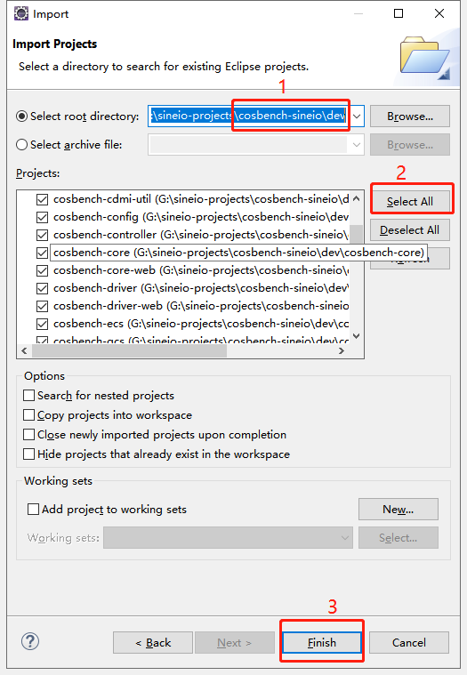
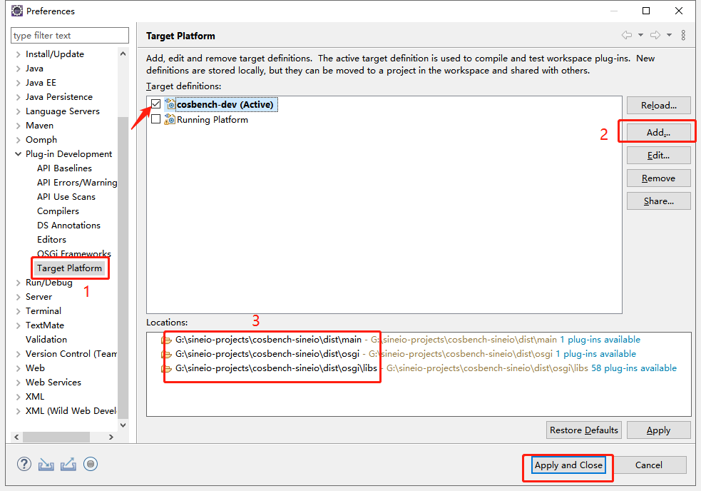
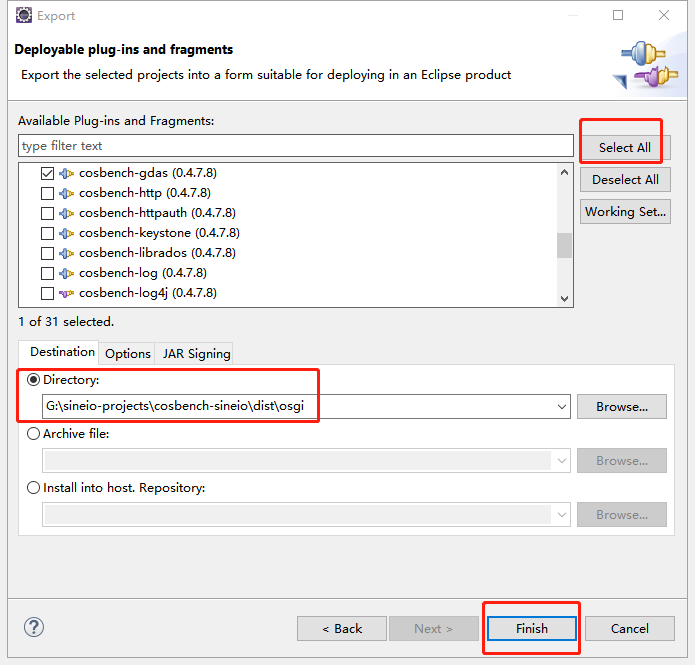

### 0. 前言

由于`COSBench`是基于`OSGI`的（用的`Equinox`，然而`Equinox`和`Eclipse`结合紧密），使用`Eclipse IDE`进行开发的（打包也会用到），所以我们需要安装好`Eclipse`。

### 1. 导入项目

#### 1.1 下载源码

```shell
git clone https://github.com/sine-io/cosbench-sineio.git
```

#### 1.2 导入项目

`File → Import → General → Existing Projects into Workspace → Next`

选择已下载项目的`dev`目录，如下图所示：



导入完毕后，会有许多报错或告警，请执行下述步骤。

`Window -> Preferences -> Plug-in Development -> Target Platform`，在`Target definitions`里新建一个`Platform`，并选择`3`个目录（选中`cosbench-dev`后进行编辑添加即可）。




### 2. 导出项目

当我们编码结束后，会进行项目导出，这样我们就可以在其他地方进行使用了。

#### 2.0 更新版本号（按需）

在`cosbench-sineio`目录里，右键执行`Git Bash here`，然后在`bash`界面执行更新命令：

```shell
# 修改VERSION文件里的版本号
vi VERSION

# 执行脚本，对项目中的版本号进行统一修改
sh version_unify.sh
```

#### 2.1 导出包

> **如果修改了版本号，在导出包之前，最好进行刷新一下各个项目，或者重启一下`eclipse`。**

`File -> Export... -> Plug-in Development -> Deployable plugins and fragments -> Next ->` 选择需要导出的项目（第一次我会选择全部导出） -> 导出目录选择 `dist\osgi`

如下图所示：



当导出结束后，生成的`tar`包会在 `dist/osgi/plugins` 里面

#### 2.2 打包

```shell
# 执行打tar包命令
sh pack-sineio.sh
```

打包完毕后，会在项目目录中生成一个 cosbench-***0.4.7.8***-sineio.tar.gz 的压缩文件，此时就已经打包成功了。

### 3. 结尾

至此，开发环境就讲述完毕了。接下来的文章会进行源码分析和开发，敬请期待。

如果可以，欢迎在[GitHub](https://github.com/sine-io/cosbench-sineio.git)上给我的项目来个Star :star: ，这将给予我极大的动力和精神鼓励。也非常欢迎提交`PR`和`issue`，谢谢。