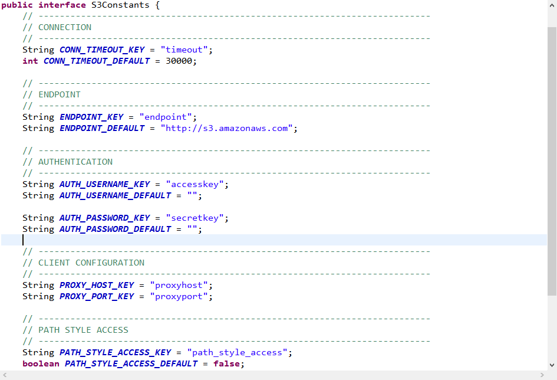

### 0. 前言

我们知道了工具怎么用，也搭建好了开发环境，当我们使用过程中会遇到各种各样的情况，会经常有这样的声音：“它是怎么实现的呢？为什么会出现这个结果呢？为什么会报错呢？”等等。当时我有一种需求是`HTTPS`请求中跳过`SSL`的验证，但是它原生不支持，我就耐着性子看源码，最后终于解决，当时开心的像个孩子。说实话，这是一个非常受折磨的过程。由于我主攻`Python`和`Go`，看`Java`是一知半解各种搜索，还好语言有共通性，我艰难的挺了过来，给我后续的二次开发打下了一些基础，受益无穷。

在这里发一个感慨：当我们跳出舒适区，忍受“折磨”的时候，要坚持，咬定青山不放松，最终的海阔天空是内啡肽，不是多巴胺。

### 1. 入手

我们打开`Eclipse`编辑器，定位到`cosbench-s3`这个`bundle`。下图展示了它的结构，我们依次来看。


#### 1.1 src目录

红框`1`里（`src`目录）是存放`s3`相关逻辑的地方，这里面有两个包（`client.S3Stor`和`api.S3Stor`）。咱们先看`client.S3Stor`这个包。

##### 1.1.1 client.S3Stor

这个包里存放了一些常量，覆盖了一部分的`S3`接口入参，这些常量赋予了默认值。它会供`api.S3Stor`包中的函数使用。我们打开`S3Constants.java`，如果你经常使用`s3`接口，用过`aws`的`S3 SDK`，那么咱们可以看到很多熟悉的身影。



```
1. timeout是http连接的超时时间，默认为30s
2. endpoint是S3接口的入口URL，默认为亚马逊的地址
3. accesskey也就是我们常说的ak，可以理解为username，默认为空
4. secretkey也就是我们常说的sk，可以理解为password，默认为空
5. proxyhost/proxyport是代理相关参数
6. path_style_access是s3连接的两种方式开关，默认为false（https://bucketname.your-s3-endpoint.com），我们是私有云一般设置为true（https://your-s3-endpoint.com/bucketname）
```

##### 1.1.2 api.S3Stor

这个包里有两个`java`文件，咱们先来看 `S3StorageFactory`。


**这个文件只有一个作用，当我们的`xml`文件里`storage`里定义不同`type`时，则会返回不同的`Storage`。**

```xml
<!-- 当我们的type写s3时，则会返回S3Storage类的实例。-->
<storage type="s3" config="xxx"/>
```

那么上面描述的`S3Storage`类是个什么东东呢？它包含了哪些内容呢，咱们来看另一个`java`文件。


这个类继承于`NoneStorage`（实现了`StorageAPI`接口，此接口中包含了众多的`S3`接口代码逻辑。感兴趣的可以按`Ctrl`点进去看一下），并且定义了几个参数和几个方法，我们来讲解经常用到的：

```markdown
参数：
1. timeout、accessKey、secretKey、endpoint这几个参数，咱们在创建客户端的时候会用到，前面的常量中也定义了默认值，这里不再赘述。
2. client是S3客户端，它是AmazonS3类型，这个类型含有许多S3接口的方法（putObject，getObject，createBucket，deleteBucket等等）
```

`init`方法：通过名字可以猜想到，它是初始化用的，初始化什么呢？对了，初始化`client`。

> 注：为了能完全显示，我去掉了空格，不过这个不影响咱们看代码。


```markdown
1. 从中间的箭头往上看（标数字1的部分），都是参数的获取，从哪里获取呢？主要是从xml文件里获取（感兴趣的可以看看cosbench-config这个bundle），这里有个逻辑是如果xml文件没设置，则读取默认值，这一点咱们要注意。
2. 从中间的箭头往下看（标数字2的部分），我们对S3的client进行了一些设置。比如设置timeout，ak/sk，pathStyle等。
```

我们获取到了`client`之后，就可以开始使用了，接下来的几个方法都是`S3`接口的调用，我们看其中一个即可，其他都是类似的。


```markdown
这里的client.putObject的调用就是aws-sdk-java中的标准用法。它还有其他putObject方法，我们可以去官网看一下怎么用，选择合适的即可。
在方法的调用中，传入了桶名、对象名、对象数据（data）、对象元数据，它们共同组成了我们要写到底层对象存储的数据信息。
```

#### 1.2 plug-in

这里引入了我们依赖的其他`bundle`，比如`StorageAPI`和`NoneStorage`就来自于`cosbench-api`。

#### 1.3 aws-sdk-java-s3-*.jar

这个`jar`包是`aws`官方标准`SDK`，当然了，这只是其中一个`jar`包。我们通过`sdk`里定义好的类、方法、属性就可以灵活的自定义代码啦。如果想看它到底怎么实现的，需要下载源码包（可以用`maven`下载后，拷贝到`cosbench-s3`目录下），然后进行引入。下图展示了引入方法（由于原生的我们没有开发过，所以这里以`SineIO`团队开发的`sineio`这个`bundle`为例子）：


依照图示，进行引入后记得保存`MANIFEST.MF`文件，此时我们按住`Ctrl`进行点击某个方法时，就可以看到`aws sdk`的代码了。

### 2. 总结

我们在本篇文章中以`cosbench-s3`这个原生的`bundle`讲述了它内部的实现逻辑。由于我水平有限，大家在看的时候，可能一头雾水，这是由于知识不对等造成的，没有关系，咱们多看几次代码结合自己的经验就会慢慢的理解了。

只看着其中一个`bundle`，可能有点偏门。咱们结合`COSBench`的一个测试场景，来画一下它的逻辑图。

测试场景：使用`s3`这个`storage`，创建一个存储桶`test01`，写入`10`个名字为`obj1~obj10`的`16KB`对象。这个测试场景的`xml`如下：

```xml
<?xml version="1.0" encoding="UTF-8" ?>
<workload name="s3 test" description="xxxx">
  <storage type="s3" config="endpoint=https://ip:port;accesskey=xxxx;secretkey=xxxx;no_verify_ssl=true;path_style_access=true;timeout=60000"/>
  
  <workflow>
	<workstage name="create bucket">
      <work type="init" workers="1" config="cprefix=test0;containers=r(1,1)" />
    </workstage>
	
	<workstage name="put obs">
	  <work name="w-1" workers="10" totalOps="100" driver="driver1">
        <operation type="write" ratio="100" config="cprefix=test0;containers=c(1);oprefix=obj;objects=s(1,10);sizes=c(512)KB" />
      </work>
    </workstage>
  </workflow>
</workload>
```

这个测试场景的大致流程图（这里只看几个主要的`bundle`流转）如下：


```markdown
这里只列了3个bundle，但实际运行过程中远远不止这些，这个要注意。
1. 我们通过web页面提交了xml文件，生成了任务
2. 通过cosbench-config进行获取和校验xml文件内容，依次进行了三种动作。
	2.1 s3 client auth：通过认证，获取session
	2.2 init：此阶段经过cosbench-driver里Initializer的逻辑，会到cosbench-s3里调用createContainer方法
	2.3 write：此阶段经过cosbench-driver里的Writer的逻辑，会到cosbench-s3里调用createObject方法
3. 每一个workstage结束后，会在web页面进行更新
```

好了，这一篇文章就讲述完毕了，咱们下篇文章再见。

如果可以，欢迎在[GitHub](https://github.com/sine-io/cosbench-sineio.git)上给我的项目来个Star :star: ，这将给予我极大的动力和精神鼓励。也非常欢迎提交`PR`和`issue`，谢谢。