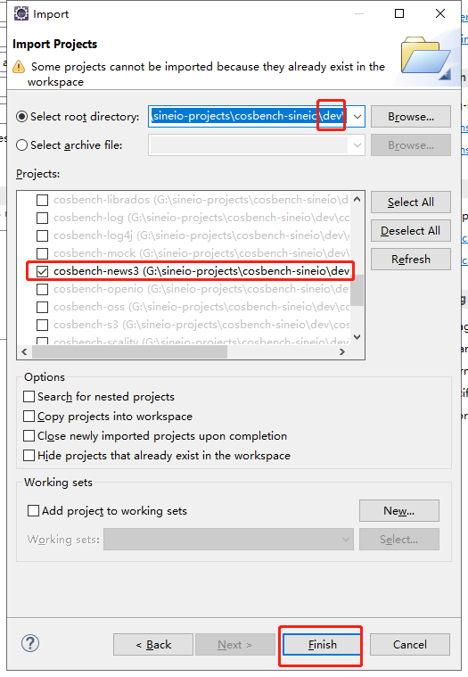
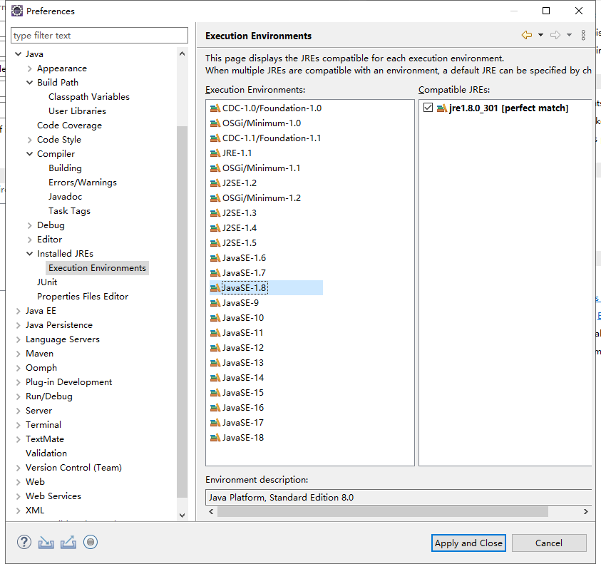
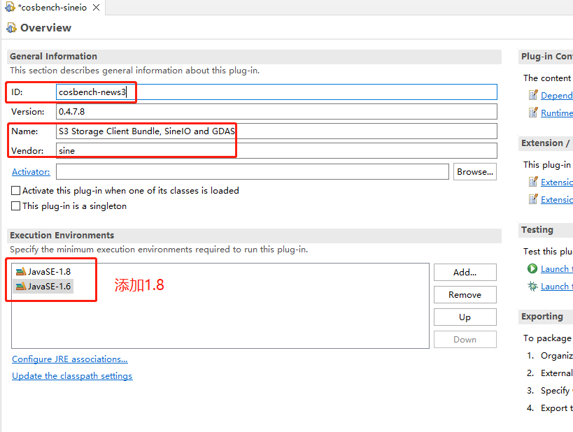
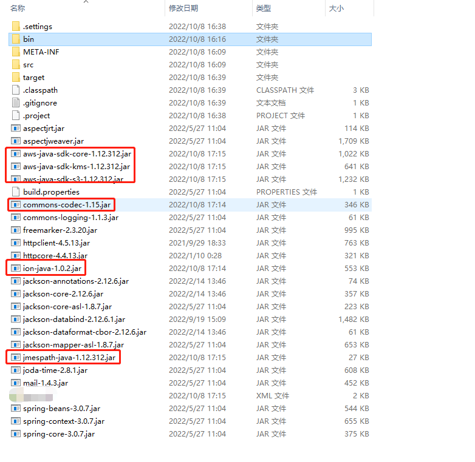
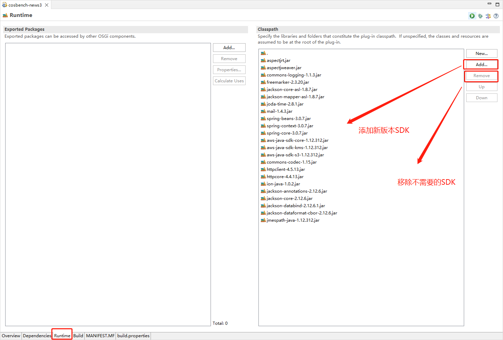
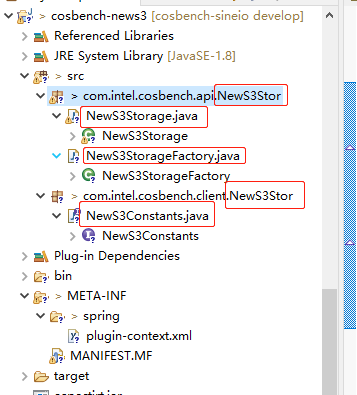
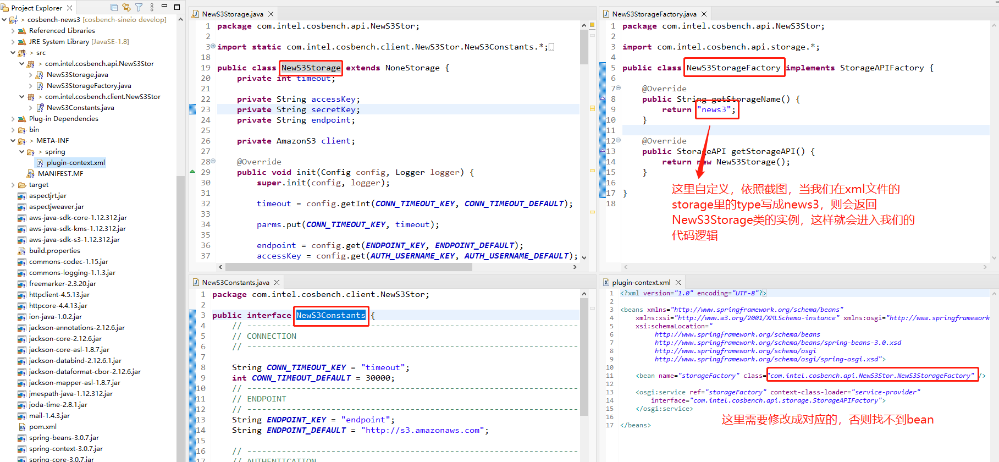

### 0. 前言

`COSBench`系列的前三篇文章，讲解了它是什么为什么怎么用、开发环境、源码解读。在这最后一篇文章里，咱们来开发一个`bundle（storage）`以便后续进行`SDK`版本更新，代码逻辑修改等。

### 1. 新建一个`bundle`

我们可以新建一个`plug-in`项目（选`osgi`），也可以选择一个偷懒的办法（选择一个近似的`bundle`进行拷贝后改造），这里我们选择后者。

a. 我们对`cosbench-s3`目录做一份拷贝，并进行重命名（我这里命名为了`cosbench-news3`）

b. 修改`cosbench-news3`目录中的` .project`文件中的那么为`cosbench-news3`

c. `eclipse`中导入此`bundle`：`File -> Import -> General -> Existing projects into Workspace -> Next`，如下图所示



至此，新`bundle`改造完毕。

### 2. 定制化

#### 2.1 修改Java环境为Java-1.8

我们后续会升级`aws-sdk-java`的版本，因为升级后的`SDK`都升级了`Java`版本，所以咱在这里进行添加。`Window -> Preferences -> Java -> Installed JREs -> Execution Environments`里选择 `JavaSE-1.8`后，勾选`Compatible JREs`里的`jre`（我这里是`1.8.0_301`）



修改`bundle`的相关信息（`ID`等字段、`Execution Environments`里添加`JavaSE-1.8`）



#### 2.2 升级aws-jdk-java

建议新建个`maven`项目，然后使用`maven`进行相关`jar`包下载，我这里为了演示方便，直接把`cosbench-news3`直接转换为`maven`项目了。示例`pom.xml`如下（`SDK`版本可自行修改）：

```xml
<project xmlns="http://maven.apache.org/POM/4.0.0" xmlns:xsi="http://www.w3.org/2001/XMLSchema-instance" xsi:schemaLocation="http://maven.apache.org/POM/4.0.0 https://maven.apache.org/xsd/maven-4.0.0.xsd">
  <modelVersion>4.0.0</modelVersion>
  <groupId>cosbench-news3</groupId>
  <artifactId>cosbench-news3</artifactId>
  <version>0.4.7.9</version>
  <build>
    <sourceDirectory>src</sourceDirectory>
    <plugins>
      <plugin>
        <artifactId>maven-compiler-plugin</artifactId>
        <version>3.8.1</version>
        <configuration>
          <source>1.6</source>
          <target>1.6</target>
        </configuration>
      </plugin>
    </plugins>
  </build>
  <dependencyManagement>
    <dependencies>
      <dependency>
        <groupId>com.amazonaws</groupId>
        <artifactId>aws-java-sdk-bom</artifactId>
        <version>1.12.312</version>
        <type>pom</type>
        <scope>import</scope>
      </dependency>
    </dependencies>
  </dependencyManagement>
  
  <dependencies>
    <dependency>
      <groupId>com.amazonaws</groupId>
      <artifactId>aws-java-sdk-s3</artifactId>
    </dependency>
  </dependencies>
</project>
```

当`maven`将依赖包下载完毕后，我们对照`Maven Dependencies`里的`jar`包路径，将其均拷贝到`cosbench-news3`目录下，并删掉之前的版本，结果如下：



对`cosbench-news3`项目进行右键刷新，然后修改`META-INF`里面的`MANIFEST.MF`文件，如下图所示：



此时，`SDK`升级完毕。

#### 2.3 编码

接下来，我们进行`bundle`开发。

##### 2.3.1 修改包名和文件名

对要进行修改的包或文件进行`右键 -> Refactor -> Rename`，修改成自定义的。我修改的如下图：




通过`Eclipse`，它会直接将类名也进行修改，接下来我们来看一下：



基础工作修改完毕，后续就是有需求后进行`coding`了。

> 大家记住`NewS3Storage.java`这个文件，我们经常与它打交道

##### 2.3.2 需求定制

我们使用以下三种需求，来依次讲解一下，这三个需求难度依次递增。

###### 2.3.2.1 需求1：跳过HTTPS的SSL验证

a. 添加配置参数

```java
// NewS3Constants.java

// 添加下面两行配置
String NO_VERIFY_SSL_KEY = "no_verify_ssl";
boolean NO_VERIFY_SSL_DEFAULT = false;
```

b. 添加代码逻辑

```java
// NewS3Storage.java

// init方法内部添加如下逻辑
boolean noVerifySSL = config.getBoolean(NO_VERIFY_SSL_KEY, NO_VERIFY_SSL_DEFAULT);
if (noVerifySSL) {
    System.setProperty(SDKGlobalConfiguration.DISABLE_CERT_CHECKING_SYSTEM_PROPERTY, "true");
}
```

至此，需求`1`就开发完毕了，至于如何使用，请看**章节`3`**

###### 2.3.2.2 需求2：修改Java文件中过期的代码

> 这里只修改 `init`方法中提示过期的部分，其余的请自行参照官网进行修改（如：`doesBucketExist ---> doesBucketExistV2`）。

```java
// init方法
// 删除下面三行
client = new AmazonS3Client(myCredentials, clientConf);
client.setEndpoint(endpoint);
client.setS3ClientOptions(new S3ClientOptions().withPathStyleAccess(pathStyleAccess));
// 添加下面几行代码
client = AmazonS3ClientBuilder.standard().withCredentials(new AWSStaticCredentialsProvider(myCredentials))
		.withClientConfiguration(clientConf).withEndpointConfiguration(new EndpointConfiguration(endpoint, ""))
		.withPathStyleAccessEnabled(pathStyleAccess).build();
```

至此，我们将`SDK`中过期的用法替换为了新的使用方法。

###### 2.3.2.3 需求3：添加restore接口

我们添加一个新接口，需要修改几个`bundle`，我们依次来进行修改。

**cosbench-api**

```java
// StorageAPI.java
// 添加一个restore接口

/**
 * Restore an object from a container.
 *
 * @param container - the name of a container.
 * @param object    - the name of an object to be restored.
 * @param config    - the configuration used for this operation.
 */
public void restoreObject(String container, String object, Config config);

// NoneStorage.java
// 对接口进行实现

@Override
public void restoreObject(String container, String object, Config config) {
	if (logging) {
		logger.info("performing RESTORE(restore-object) at /{}/{}", container, object);
    }
}
```

**cosbench-news3**

```java
// NewS3Constants.java

// 添加一个参数：取回天数
String RESTORE_DAYS_KEY = "restore_days";
int RESTORE_DAYS_DEFAULT = 1;
```

```java
// NewS3Storage.java

// 0. 在添加公共参数
private AmazonS3 restoreClient;
private boolean pathStyleAccess;
private String proxyHost;
private String proxyPort;
private boolean noVerifySSL;
private int restoreDays;

// 1. 修改init方法如下
@Override
public void init(Config config, Logger logger) {
	super.init(config, logger);

	timeout = config.getInt(CONN_TIMEOUT_KEY, CONN_TIMEOUT_DEFAULT);
	endpoint = config.get(ENDPOINT_KEY, ENDPOINT_DEFAULT);
	accessKey = config.get(AUTH_USERNAME_KEY, AUTH_USERNAME_DEFAULT);
	secretKey = config.get(AUTH_PASSWORD_KEY, AUTH_PASSWORD_DEFAULT);
	
	pathStyleAccess = config.getBoolean(PATH_STYLE_ACCESS_KEY, PATH_STYLE_ACCESS_DEFAULT);
	
	proxyHost = config.get(PROXY_HOST_KEY, "");
	String proxyPort = config.get(PROXY_PORT_KEY, "");
	parms.put(PROXY_PORT_KEY, proxyPort);
	
	noVerifySSL = config.getBoolean(NO_VERIFY_SSL_KEY, NO_VERIFY_SSL_DEFAULT);
	if (noVerifySSL) {
		System.setProperty(SDKGlobalConfiguration.DISABLE_CERT_CHECKING_SYSTEM_PROPERTY, "true");
	}
	
	restoreDays = config.getInt(RESTORE_DAYS_KEY, RESTORE_DAYS_DEFAULT);

	initClient();
	initRestoreClient();
}

// 2. 在NewS3Storage类里面添加如下3个方法
private ClientConfiguration getDefaultClientConfiguration(String signType) {

	ClientConfiguration defaultClientConfiguration = new ClientConfiguration();
	// Set connection timeout for initially establishing a connection.
	defaultClientConfiguration.setConnectionTimeout(timeout);
	// Set socket timeout for data to be transferred.
	defaultClientConfiguration.setSocketTimeout(timeout);
	
	// use expect continue HTTP/1.1 header.
	defaultClientConfiguration.withUseExpectContinue(false);
	// Set Signer type.
	defaultClientConfiguration.withSignerOverride(signType);

	if ((!proxyHost.equals("")) && (!proxyPort.equals(""))) {
		defaultClientConfiguration.setProxyHost(proxyHost);
		defaultClientConfiguration.setProxyPort(parms.getInt(PROXY_PORT_KEY));
	}

	return defaultClientConfiguration;
}

private AmazonS3 initClient() {
	logger.debug("initialize S3 client with storage config: {}", parms);

	ClientConfiguration clientConf = getDefaultClientConfiguration("S3SignerType");

	AWSCredentials myCredentials = new BasicAWSCredentials(accessKey, secretKey);

	EndpointConfiguration myEndpoint = new EndpointConfiguration(endpoint, "");

	client = AmazonS3ClientBuilder.standard().withCredentials(new AWSStaticCredentialsProvider(myCredentials))
			.withClientConfiguration(clientConf).withEndpointConfiguration(myEndpoint)
			.withPathStyleAccessEnabled(pathStyleAccess).build();

	logger.debug("S3 client has been initialized");

	return client;
}

private AmazonS3 initRestoreClient() {

	logger.debug("initialize S3 Restore client with storage config: {}", parms);

	ClientConfiguration clientConf = getDefaultClientConfiguration("AWSS3V4SignerType");

	AWSCredentials myCredentials = new BasicAWSCredentials(accessKey, secretKey);

	EndpointConfiguration myendpoint = new EndpointConfiguration(endpoint, "");
	restoreClient = AmazonS3ClientBuilder.standard()
			.withCredentials(new AWSStaticCredentialsProvider(myCredentials)).withClientConfiguration(clientConf)
			.withEndpointConfiguration(myendpoint)
			.withPathStyleAccessEnabled(pathStyleAccess).build();

	logger.debug("S3 Restore client has been initialized");

	return restoreClient;
}
```

```java
// NewS3Storage.java

// 在NewS3Storage类中添加取回方法

@Override
public void restoreObject(String container, String object, Config config) {
	super.restoreObject(container, object, config);
	try {
		RestoreObjectRequest request = new RestoreObjectRequest(container, object, restoreDays);
		restoreClient.restoreObjectV2(request);

		ObjectMetadata response = restoreClient.getObjectMetadata(container, object);
		Boolean restoreFlag = response.getOngoingRestore();
		logger.info(object + " at bucket -> " + container + " | Restore days: " + restoreDays
				+ ", and ongoing-request status is: " + restoreFlag);

	} catch (Exception e) {
		throw new StorageException(e);
	}
}
```

**cosbench-driver**

```java
// Operators.java

// createOperator方法里添加restore判断
if (StringUtils.equals(type, Restorer.OP_TYPE)) {
    return new Restorer();
}
```

```java
// 在com.intel.cosbench.driver.operator包里新建一个java文件（Restorer.java）
// 内容如下：
package com.intel.cosbench.driver.operator;

import java.util.Date;

import com.intel.cosbench.bench.*;
import com.intel.cosbench.config.Config;
import com.intel.cosbench.driver.util.ObjectPicker;
import com.intel.cosbench.service.AbortedException;
import com.intel.cosbench.api.storage.StorageException;
import com.intel.cosbench.api.storage.StorageInterruptedException;


class Restorer extends AbstractOperator {

	public static final String OP_TYPE = "restore";

	private ObjectPicker objPicker = new ObjectPicker();

	public Restorer() {
		/* empty */
	}

	@Override
	protected void init(String id, int ratio, String division, Config config) {
		super.init(id, ratio, division, config);
		objPicker.init(division, config);
	}

	@Override
	public String getOpType() {
		return OP_TYPE;
	}

	@Override
	protected void operate(int idx, int all, Session session) {
		String[] path = objPicker.pickObjPath(session.getRandom(), idx, all);
		Sample sample = doRestoreV2(path[0], path[1], config, session, this);
		session.getListener().onSampleCreated(sample);
		Date now = sample.getTimestamp();
		Result result = new Result(now, getId(), getOpType(), getSampleType(), getName(), sample.isSucc());
		session.getListener().onOperationCompleted(result);
	}

	public static Sample doRestoreV2(String conName, String objName, Config config, Session session, Operator op) {

		if (Thread.interrupted())
			throw new AbortedException();

		long start = System.nanoTime();

		try {
			session.getApi().restoreObject(conName, objName, config);
		} catch (StorageInterruptedException sie) {
			doLogErr(session.getLogger(), sie.getMessage(), sie);
			throw new AbortedException();
		} catch (StorageException se) {
			String msg = "Error restore-object " + conName + "/" + objName + " " + se.getMessage();
			doLogWarn(session.getLogger(), msg);
			
			return new Sample(new Date(), op.getId(), op.getOpType(), op.getSampleType(), op.getName(), false);
		} catch (Exception e) {
			isUnauthorizedException(e, session);
			errorStatisticsHandle(e, session, conName + "/" + objName);

			return new Sample(new Date(), op.getId(), op.getOpType(), op.getSampleType(), op.getName(), false);
		}

		long end = System.nanoTime();

		return new Sample(new Date(), op.getId(), op.getOpType(), op.getSampleType(), op.getName(), true,
				(end - start) / 1000000, 0L, 0L);
	}

}

```

至此，“需求`3`”就开发完毕，接下来在第三章节，咱们进行配置修改，修改完配置后，就可以打包进行验证了。

### 3. 修改配置

```shell
cd cosbench-sineio/release/conf/.driver
vi config.ini # 或者直接使用nodepad++等类似编辑器打开
# 添加如下配置：
plugins/cosbench-news3@7\:start,\
```

```shell
cd cosbench-sineio/release
vi start-driver.sh # 或者直接使用nodepad++等类似编辑器打开
# 大约45行，添加 cosbench-news3_${VERSION}
OSGI_BUNDLES="... cosbench-s3_${VERSION} cosbench-news3_${VERSION} ... cosbench-driver-web_${VERSION}"
```

### 4. 打包验证

打包流程请参考第二篇文章，这里按下不表，直接说部署新包后进行验证。

当我们将新版本部署好后，可以使用下面的`xml`配置来进行验证。

```xml
<?xml version="1.0" encoding="UTF-8" ?>
<workload name="s3 test" description="xxx">

  <storage type="news3" config="endpoint=https://ip:port;accesskey=xxx;secretkey=xxx;no_verify_ssl=true;restore_days=1;path_style_access=true;timeout=60000" />
 
  <workflow>
	<workstage name="create bucket">
      <work type="init" workers="1" config="cprefix=bkt0;containers=r(1,1)" />
    </workstage>
      
    <workstage name="prepare example">
      <work type="prepare" workers="1" config="cprefix=bkt0;containers=r(1,1);objects=r(1,10);sizes=c(64)KB" />
    </workstage>
      
    <workstage name="restore object example">
      <work name="restore test" workers="5" totalOps="10">
        <operation type="restore" ratio="100" config="cprefix=bkt0;containers=c(1);objects=r(1,10)" />
      </work>
    </workstage>
  </workflow>
</workload>
```

> 注意以下几点：
>
> 1. storage的type修改为news3
> 2. storage的config里添加配置 no_verify_ssl和restore_days
>
> 这样就会使用咱们新建的storage，并且使用咱们配置的参数

### 5. 结尾

第四篇是终章，本系列到了说再见的时候了。

这系列文章难度逐步递进，我把它整理出来，供大家参考。

如果可以，欢迎在[GitHub](https://github.com/sine-io/cosbench-sineio.git)上给我的项目来个Star :star: ，这将给予我极大的动力和精神鼓励。也非常欢迎提交`PR`和`issue`，谢谢。

朋友们，江湖再见。:seedling:

