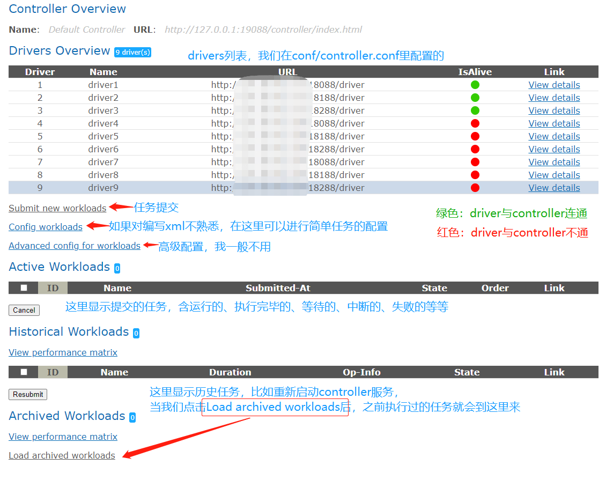
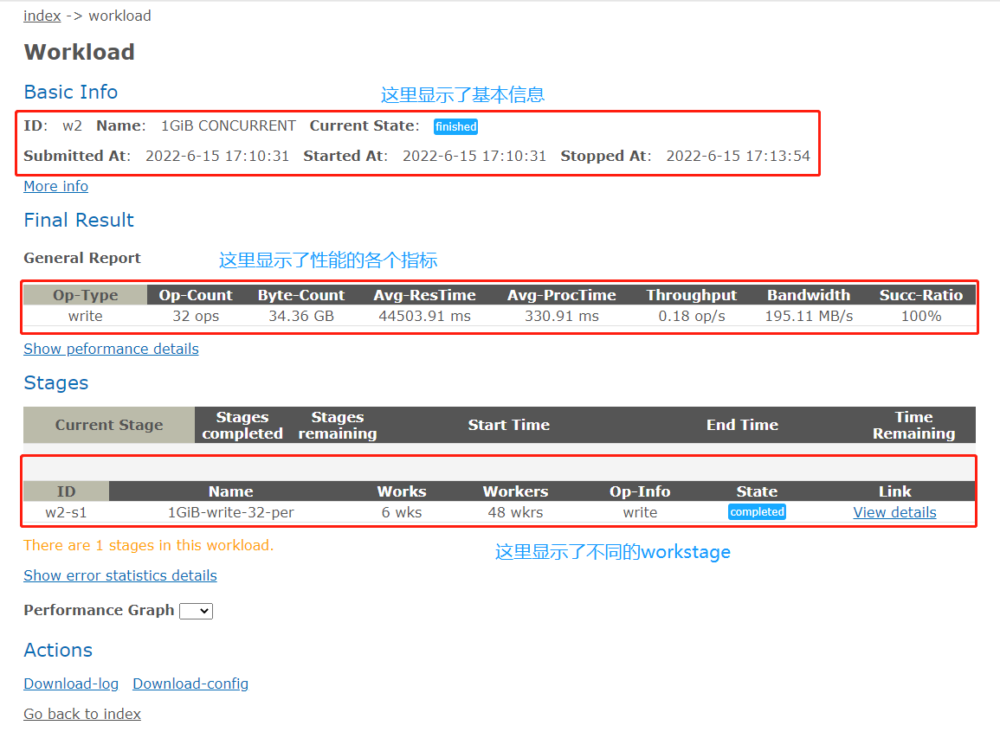
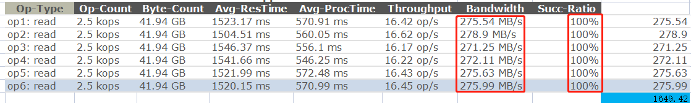

### 0. 前言

从今天起，咱们来共同学习探讨一下 `COSBench` 这个工具。

本系列总共分为下面几大部分：

1. `COSBench` 认识、使用、结果分析
2. `COSBench` 开发环境配置
3. `COSBench` 源码分析（主要是`cosbench-s3`）
4. `COSBench` 开发一个适配器

### 1. 介绍

随着云时代的到来，公有云、私有云、混合云等快速进入到大家的视野，随着数据量指数级增长，数据存储成了重中之重。对象存储结合了块存储的速度和文件存储的容量，应对海量数据，它更加游刃有余。现在各厂的存储产品除了自研，其他基本都是基于`Ceph`或`Minio`等开源方案进行开发。当我们开发出了一款存储产品，很大一块的宣传就是它的性能如何如何，那么我们怎么来衡量呢？那么`COSBench`则是衡量对象存储性能的其中一款测试工具。

`COSBench `是 `Intel`团队基于 `Java`语言开发，衡量**云对象存储服务性能**的**基准**测试工具，全称是`Cloud Object Storage Bench`。同所有的性能测试工具一样，`COSBench `分`controller`和真正施加负载的`driver`，且`driver`可以分布式部署。可以支持`swift、s3、Openstack`等接口，`SineIO`团队基于`cosbench-openio`版本做了新的开发，**自定义了基于`S3`协议的新适配器（`sio、gdas`）**，更加贴合自研对象存储产品。这两个新适配器新增了功能与优化（比如分段上传、列出对象逻辑优化、SDK版本升级等等），大家可以通过地址进行[下载](https://github.com/sine-io/cosbench-sineio.git)和试用。

`COSBench` 支持**自定义适配器**，这一点给了它非常优秀的扩展性和适配性，为它成为对象存储协议通用性能基准测试工具打好了坚实的基础。

### 2. 架构

下图很好的诠释了`COSBench`架构：


`COSBench` 通过`controller `加载自定义的压力模型配置文件（`xxx.xml`），并分发压力到各个`driver`上，由`driver`对底层存储服务施加压力，达到性能压测的目的。

`drivers `采用分布式部署，多个 `driver `在压力服务器上为多个`Java`进程，每个`driver`会多线程并发请求（在`COSBench`中为`workers`数）。

说几点我的经验，供大家参考：

- a. `controller`启动一个即可，这个是共识，就不说了
- b. `drivers`分布于各个压力节点上，每个节点我会启动多个`drivers`（我一般启动`2`个，最多的时候启动到`4`个）
- c. 压测配置文件中，每个`driver `我一般会分配`50`个`workers`
- d. 压测机的`CPU`（比如：`48`核心）/内存（比如：`64GB`）最好大一些，`OS`盘最好是`SSD`
- e. 压测之前，要测试压力机与存储服务器间的网络是否有瓶颈（我一般用`iperf3`，记得双向都打一下）
- f. 压测之前，建议用`fio`这类的压测工具打一下盘，看一下`raid`卡等硬件有没有瓶颈（直接压多个硬盘就行）
- g. 最后一点是底层存储的性能估算，我一般用的估算公式是：`单个存储服务器的硬盘个数 * 单个硬盘的带宽 * 0.7`

举例：底层存储为`3`节点，每个节点的数据池含`HDD 36`块，假设每块`HDD`的写速度为`150MB/s`，那写入的带宽估算公式为：`36\*150\*0.7=3780MB/s`

当然，这只是理论估算，一般底层存储无法全部利用硬件的性能。像`HDD`，一般读写平均带宽在`80MB/s`就很好了（个人见解），所以大家要根据实际情况去印证自己的估算，逐渐纠偏。

### 3. 部署

了解了工具是什么，干什么用的，那接下来看看它到底怎么用。

#### 3.0 压力机规划

| 节点名称 | 启动服务                            | 角色               |
| -------- | ----------------------------------- | ------------------ |
| 压力机1  | controller * 1<br />drivers *2 或 4 | 主控机<br />压力机 |
| 压力机2  | drivers *2 或 4                     | 压力机             |
| 压力机3  | drivers *2 或 4                     | 压力机             |

#### 3.1 部署 --- 非容器化方式

```shell
# CentOS 7.7 or 7.9 操作系统

# 关闭防火墙或者防火墙打开19088 19089 18088 18089端口，我这里直接关闭防火墙
systemctl stop firewalld

# 安装依赖包
yum install telnet nmap-ncat curl wget vim -y

# 安装openjdk或者自己安装java环境，我这里直接安装openjdk
yum install java-1.8.0-openjdk -y
# 这里说明一下，建议用1.8及以上的java，因为之前的版本会存在bug，可能会导致测试不准确或者程序异常等问题。

# 清除环境变量
unset http_proxy
# 下载部署包后解压进行部署（三个压力节点均下载和执行）
wget https://github.com/sine-io/cosbench-sineio/releases/download/0.4.7.9/cosbench-0.4.7.9-sineio.tar.gz
tar -xf cosbench-0.4.7.9-sineio.tar.gz
cd cosbench-0.4.7.9-sineio

# 在压力机1、2、3上均启动2个driver
sh start-driver.sh 2

# 在压力机1上启动controller
vim conf/controller.conf
```

> 注意：
>
> 1. drivers的数量要与下面提供的driver数量保持一致
> 2. 各个driver的名字不能重复

```shell
[controller]
drivers = 6
log_level = INFO
log_file = log/system.log
archive_dir = archive

[driver1]
name = driver1
url = http://压力机1IP:18088/driver

[driver2]
name = driver2
url = http://压力机1IP:18188/driver

[driver3]
name = driver3
url = http://压力机2IP:18288/driver

[driver4]
name = driver4
url = http://压力机2IP:18088/driver

[driver5]
name = driver5
url = http://压力机3IP:18188/driver

[driver6]
name = driver6
url = http://压力机3IP:18288/driver
```

```shell
# 保存退出

# 启动controller
sh start-controller.sh

# 浏览器打开CosBench网站即可使用
http://压力机1IP:19088/controller/index.html
```

#### 3.2 部署 --- `docker-compose`方式

我们参照`cosbench-openio`（在此对`openio`的开发人员表示感谢）编写并制作了`cosbench-sineio`的`docker`镜像（分别基于`Ubuntu`、`CentOS`和`Alpine`），大家可以使用`docker`启动`COSBench`。

后续还会增加`docker swarm`、`K8S`的方式，敬请期待。

> 前提：三台压力机上均部署好`docker、docker-compose`环境

```shell
# docker-compose方式
# 参考GitHub地址：https://github.com/sine-io/cosbench-sineio.git项目下的docker目录

# 压力机2和3上 启动driver
cd /opt/
mkdir cosbench-sineio && cd cosbench-sineio

# 编辑docker-compose文件，也可以直接下载后进行编辑
vim drivers.yml
```

> 注：可以自行更换为`alpine`版本

```yaml
version: '3.9'

services:
  driver1:
    image: "sineio/cosbench-sineio:0.4.7.9-ubuntu"
    environment:
      CONTROLLER: false
      DRIVER: true
      DRIVER_PORT: 18088
      COSBENCH_PLUGINS: "SIO,S3"
    volumes:
      - /data/cosbench/driver1-log/:/cosbench/log
      - /etc/resolv.conf:/etc/resolv.conf:ro
      - /etc/hosts:/etc/hosts:ro
      - /etc/localtime:/etc/localtime:ro
    healthcheck:
      test: ["CMD", "curl", "-f", "http://127.0.0.1:18088/driver"]
      interval: 30s
      timeout: 20s
      retries: 3
    restart: unless-stopped
    tty: true
    stdin_open: true
    network_mode: "host"

  driver2:
    image: "sineio/cosbench-sineio:0.4.7.9-ubuntu"
    environment:
      CONTROLLER: false
      DRIVER: true
      DRIVER_PORT: 18188
      COSBENCH_PLUGINS: "SIO,S3"
    volumes:
      - /data/cosbench/driver2-log/:/cosbench/log
      - /etc/resolv.conf:/etc/resolv.conf:ro
      - /etc/hosts:/etc/hosts:ro
      - /etc/localtime:/etc/localtime:ro
    healthcheck:
      test: ["CMD", "curl", "-f", "http://127.0.0.1:18188/driver"]
      interval: 30s
      timeout: 20s
      retries: 3
    restart: unless-stopped
    tty: true
    stdin_open: true
    network_mode: "host"
```

```shell
# 保存退出，启动drivers（请确保端口18088、18188、18089、18189未被占用）
docker-compose -f drivers.yml up -d
```

```shell
# 在 压力机1 上启动2个drivers 和 1个controller
cd /opt/
mkdir cosbench-sineio && cd cosbench-sineio
vim all.yml
```

```yaml
version: '3.9'

services:
  driver1:
    image: "sineio/cosbench-sineio:0.4.7.9-ubuntu"
    environment:
      CONTROLLER: false
      DRIVER: true
      DRIVER_PORT: 18088
      COSBENCH_PLUGINS: "SIO,S3"
    volumes:
      - /data/cosbench/driver1-log/:/cosbench/log
      - /etc/resolv.conf:/etc/resolv.conf:ro
      - /etc/hosts:/etc/hosts:ro
      - /etc/localtime:/etc/localtime:ro
    healthcheck:
      test: ["CMD", "curl", "-f", "http://127.0.0.1:18088/driver"]
      interval: 30s
      timeout: 20s
      retries: 3
    restart: unless-stopped
    tty: true
    stdin_open: true
    network_mode: "host"

  driver2:
    image: "sineio/cosbench-sineio:0.4.7.9-ubuntu"
    environment:
      CONTROLLER: false
      DRIVER: true
      DRIVER_PORT: 18188
      COSBENCH_PLUGINS: "SIO,S3"
    volumes:
      - /data/cosbench/driver2-log/:/cosbench/log
      - /etc/resolv.conf:/etc/resolv.conf:ro
      - /etc/hosts:/etc/hosts:ro
      - /etc/localtime:/etc/localtime:ro
    healthcheck:
      test: ["CMD", "curl", "-f", "http://127.0.0.1:18188/driver"]
      interval: 30s
      timeout: 20s
      retries: 3
    restart: unless-stopped
    tty: true
    stdin_open: true
    network_mode: "host"

  controller:
    image: "sineio/cosbench-sineio:0.4.7.9-ubuntu"
    environment:
      CONTROLLER: true
      DRIVER: false
      DRIVERS: "http://压力机1IP:18088/driver,http://压力机1IP:18188/driver,http://压力机2IP:18088/driver,http://压力机2IP:18188/driver,http://压力机3IP:18088/driver,http://压力机3IP:18188/driver,"
    depends_on:
      driver1:
        condition: service_healthy
      driver2:
        condition: service_healthy
    volumes:
      - /data/cosbench/archive/:/cosbench/archive
      - /data/cosbench/controller-log/:/cosbench/log
      - /etc/resolv.conf:/etc/resolv.conf
      - /etc/hosts:/etc/hosts
      - /etc/localtime:/etc/localtime:ro
    healthcheck:
      test: ["CMD", "curl", "-f", "http://127.0.0.1:19088/controller/index.html"]
      interval: 60s
      timeout: 20s
      retries: 3
    restart: unless-stopped
    tty: true
    stdin_open: true
    network_mode: "host"
```

> 注：如有问题，欢迎提`PR`和`issue`至`github`上：
>
> https://github.com/sine-io/cosbench-sineio.git
>

### 4. 使用

到这里，软件已经部署好了，那么接下来，我们来看一下怎么用。

> 注：压缩包解压完毕后，在解压目录的conf文件夹下有示例，供大家参考。
>
> 示例1：sio-config-sample.xml
>
> 示例1参考地址：https://github.com/sine-io/cosbench-sineio/blob/main/release/conf/sio-config-sample.xml
>
> 示例2：gdas-config-sample.xml
>
> 示例2参考地址：https://github.com/sine-io/cosbench-sineio/blob/main/release/conf/gdas-config-sample.xml

#### 4.1 配置文件讲解

下面以`sio-config-sample.xml`讲解一下：

```xml
<?xml version="1.0" encoding="UTF-8" ?>
<!-- workload处于最外层，包裹了整个性能测试过程 -->
<workload name="xml-sample" description="sample benchmark for ehualu s3">
  
  <!-- workflow 定义了整个性能工作流，它含有1个或多个workstage -->
  <workflow>
    <!-- New feature to sio and siov2 -->
	<!-- mprepare, multipart upload object -->
    <!-- workstage定义了一个测试阶段，比如此阶段我们只做写入（通过type来修改）的性能测试-->
	<workstage name="mprepare example">
      <!-- storage定义了存储类型，包含许多类型，如果是S3协议存储，可以sio或s3等等，通过type进行指定即可 -->
      <!-- config里面配置了连接此存储的AK/SK，endpoint等信息，不同存储的可配置参数不同，sio的可参考下面配置 -->
	  <storage type="sio" config="accesskey=<accesskey>;secretkey=<scretkey>;proxyhost=<proxyhost>;proxyport=<proxyport>;endpoint=<endpoint>;path_style_access=true" />
      <!-- work定义了负载，其中type定义了负载类型，是写入/读取等等，workers定义了并发数，config定义了负载的一些参数，下面来一一说明 -->
      <!-- cprefix为存储桶的前缀，containers是紧跟前缀的字符，如果我创建一个存储桶名字为test1，那么cprefix为test，containers为r(1,1) -->
      <!-- 其中r(1,1)中的r是选择器，cosbench包括多种选择器，不同的workstage可是使用的选择器也不同，大家可以参考COSBenchUserGuide.pdf -->
      <!-- objects定义了对象名字从1到10，如果不加oprefix的话，那前缀为默认值，oprefix建议添加 -->
      <!-- sizes定义了文件粒度，可以是单个粒度，也可以是不同粒度配比 -->
      <work type="mprepare" workers="1" config="cprefix=s3testqwer;containers=r(1,2);objects=r(1,10);sizes=c(64)KB" />
    </workstage>
	<!-- end -->
	
	<!-- mwrite, multipart upload object -->
    <workstage name="mwrite example">
      <work name="mwrite test" workers="8" runtime="30">
	    <!-- part_size: default is 5MiB, must be set >= 5MiB -->
	    <storage type="sio" config="accesskey=<accesskey>;secretkey=<scretkey>;proxyhost=<proxyhost>;proxyport=<proxyport>;endpoint=<endpoint>;path_style_access=true;part_size=5242880" />
        <operation type="mwrite" ratio="100" config="cprefix=s3testqwer;containers=u(1,2);objects=u(11,20);sizes=c(64)KB" />
      </work>
    </workstage>
	<!-- end -->
	
	<!-- restore, restore object -->
	<workstage name="restore object example">
      <work name="restore test" workers="8" runtime="30">
	    <!-- restore_days: default is 1 -->
	    <storage type="sio" config="accesskey=<accesskey>;secretkey=<scretkey>;proxyhost=<proxyhost>;proxyport=<proxyport>;endpoint=<endpoint>;path_style_access=true;restore_days=1" />
        <operation type="restore" ratio="100" config="cprefix=s3testqwer;containers=u(1,2);objects=u(11,20);sizes=c(64)KB" />
      </work>
    </workstage>
	<!-- end -->
	
	<!-- storage_class, default is STANDARD -->
	<workstage name="set object's storage_class">
      <work name="storage class test" workers="8" runtime="30">
	  <!-- storage_class must exist in your storage -->
	    <storage type="sio" config="accesskey=<accesskey>;secretkey=<scretkey>;proxyhost=<proxyhost>;proxyport=<proxyport>;endpoint=<endpoint>;path_style_access=true;storage_class=GLACIER" />
		<!-- write, mwrite -->
        <operation type="write" ratio="100" config="cprefix=s3testqwer;containers=u(1,2);objects=u(11,20);sizes=c(64)KB" />
      </work>
    </workstage>
	<!-- end -->
	
	<!-- no_verify_ssl, default is false -->
	<workstage name="disable verify ssl example">
      <work name="https test" workers="8" runtime="30">
	    <storage type="sio" config="accesskey=<accesskey>;secretkey=<scretkey>;proxyhost=<proxyhost>;proxyport=<proxyport>;endpoint=<endpoint>;path_style_access=true;no_verify_ssl=true" />
		<!-- write, read, etc. -->
        <operation type="head" ratio="100" config="cprefix=s3testqwer;containers=u(1,2);objects=u(11,20);sizes=c(64)KB" />
      </work>
    </workstage>
	<!-- end -->
	
	
	<!-- GiB, MiB, KiB, etc. 2^n, not 10^n -->
	<workstage name="object size is 1024 based">
      <work name="object size test" workers="8" runtime="30">
	    <storage type="sio" config="accesskey=<accesskey>;secretkey=<scretkey>;proxyhost=<proxyhost>;proxyport=<proxyport>;endpoint=<endpoint>;path_style_access=true;no_verify_ssl=true" />
		<!-- write, mwrite, both ok. -->
        <operation type="write" ratio="100" config="cprefix=s3testqwer;containers=u(1,2);objects=u(11,20);sizes=c(64)KiB" />
      </work>
    </workstage>
	<!-- end -->
	
	
	<!-- aws_region: just for siov2 -->
	<workstage name="set aws_region example">
      <work name="https test" workers="8" runtime="30">
	    <!-- aws_region: default is us-east-1. Normally, there is no need to set this parameter. -->
	    <storage type="siov2" config="accesskey=<accesskey>;secretkey=<scretkey>;proxyhost=<proxyhost>;proxyport=<proxyport>;endpoint=<endpoint>;path_style_access=true;aws_region=us-east-1" />
		<!-- write, read, etc. -->
        <operation type="head" ratio="100" config="cprefix=s3testqwer;containers=u(1,2);objects=u(11,20);sizes=c(64)KiB" />
      </work>
    </workstage>
	<!-- end -->

  </workflow>
  
  
  <!-- Same to s3, storage type: gdas or sio or s3, both ok. -->
  <!--
  <storage type="s3" config="accesskey=<accesskey>;secretkey=<scretkey>;proxyhost=<proxyhost>;proxyport=<proxyport>;endpoint=<endpoint>;path_style_access=true" />
  
  <workflow>

    <workstage name="init">
      <work type="init" workers="1" config="cprefix=s3testqwer;containers=r(1,2)" />
    </workstage>

    <workstage name="prepare">
      <work type="prepare" workers="1" config="cprefix=s3testqwer;containers=r(1,2);objects=r(1,10);sizes=c(64)KB" />
    </workstage>
	
    <workstage name="main">
      <work name="main" workers="8" runtime="30">
        <operation type="read" ratio="80" config="cprefix=s3testqwer;containers=u(1,2);objects=u(1,10)" />
        <operation type="write" ratio="20" config="cprefix=s3testqwer;containers=u(1,2);objects=u(11,20);sizes=c(64)KB" />
      </work>
    </workstage>

    <workstage name="cleanup">
      <work type="cleanup" workers="1" config="cprefix=s3testqwer;containers=r(1,2);objects=r(1,20)" />
    </workstage>

    <workstage name="dispose">
      <work type="dispose" workers="1" config="cprefix=s3testqwer;containers=r(1,2)" />
    </workstage>

  </workflow>
  -->
</workload>
```

> `operation`的讲解：
>
> 1. `write`：对应上传接口（`put-object`）
> 2. `read`：对应下载对象接口（`get-object`）
> 3. `mwrite`：对应分段上传对象接口（`create-multipart-upload+upload-part+complete-multipart-upload`）
> 4. `restore`：对应取回对象接口（`restore-object`）
> 5. `delete`：对应删除对象接口（`delete-object`）
> 6. `list`：对应列出桶内对象接口（`list-objects-v2`）
> 7. `head`：对应获取对象信息接口（`head-object`）
> 8. `filewrite`：将本地的对象通过上传接口（`put-object`）上传到对象存储
> 9. `mfilewrite`：将本地的对象通过分段上传接口（`create-multipart-upload+upload-part+complete-multipart-upload`）上传到对象存储

> 注意几个特殊的`workstage`：
>
> 1. `init`一般用于创建存储桶
> 2. `prepare`一般用于创建文件，用的`put-object`接口，供后续的读操作使用
> 2. `mprepare`跟`prepare`同样的效果，用的分段上传接口
> 3. `cleanup`一般用于后续的清理工作（删对象）
> 4. `dispose`一般用于清理工作（删桶）
>
> 我一般不进行`cleanup`和`dispose`，因为存储中有一定数据量后，查看性能是否下降也是一个测试方面，大家可自行选择。

#### 4.2 提交测试

##### 方法一、使用`controller web`提交，这是我常用的方法，因为便于观察和排错

```
a. 将编辑好的xml文件保存到电脑的某个目录下

b. 访问 http://你的IP地址:19088/controller/index.html

c. 点击Submit new workloads

d. 在Workload config那里选择文件后进行submit即可
```

##### 方法二、使用`cli`提交任务（我不常用）

```shell
cd cosbench-0.4.7.9-sineio

sh cli.sh submit xxx.xml anonymous:cosbench@你的IP:19088

之后我们可以去web页面上查看提交的任务
```

> **注意：**
>
> 1. 我们可以提交多个任务（即多个`xml`文件），它会自动加入到任务队列中，我们还可以对任务进行排序。

### 5. 结果分析

当我们提交完测试后，可以在`index`页面的`Active Workloads`中找到已提交的任务，这里可以查看正在运行任务的详细信息。我们点击`View details`后可以进入任务详情页面。

#### 5.1 index页面的解释



#### 5.2 关于workload的页面



> 这里讲一下`General Report`这一栏，着重关注下面几个值：
>
> `Avg-ResTime`：平均时延，它为存储服务处理请求的时间，包含数据传输时间，一般小文件（比如`KB`级别）我们也会关注这个值，此值越低，小文件的`IOPS`越好
>
> `Avg-ProcTime`：平均处理时间，它为存储服务处理请求的时间，不包含数据传输时间
>
> `Throughput`：吞吐量，当我们的文件粒度为`1M`及以下时，着重关注这个值，描述了当前文件粒度下的读写等性能（`IOPS`）
>
> `Bandwidth`：带宽，当我们的文件粒度为`1M`以上时，着重关注这个值，描述了当前文件粒度下的读写等性能（`MB/s`等单位）
>
> `Succ-Ratio`：请求成功率，这里一般都要求`100%`
>
> 
>
> 这里说一下`IOPS`这个单位，防止有人误会。`IOPS`一般用于块存储，在我测试对象存储性能的过程中，给其他同事描述的时候，大家普遍接受`IOPS`这个单位，我跟其他存储厂商同事交流过，他们也用这个表示过。所以我就直接拿来用于代表小文件的性能，大家一看基本就能明白。如果您不喜欢这么表示，可以使用`OP/s`

```markdown
特别提醒：

1. 测试过程中要到压力机和存储服务器中看一下资源情况
我会用top查看CPU，内存等资源情况
用iostat查看硬盘情况
用sar查看网络带宽情况

2. 有条件的可以搭建一套Prometheus + Grafana + node-exporter 进行资源监控

3. 进行监控的目的有几个，一要确认咱给的压力是不是合适、二要看数据到底有没有落盘、三是监控与web页面的值进行对比
```

#### 5.3 分析

当测试执行完毕后，我们要进行结果收集与分析，下面依次来讲一下我的做法。

##### 5.3.1 结果收集

我们进行性能测试，不可能使用`1`个`driver`，当我们使用多个`drivers`的时候，在`General Report`处会有多行值，我会把这个值拷贝到`Excel`中进行处理。



> 1. 在我们拷贝到`Excel`中之前，首先我们应该关注`Succ-Ratio`，全是`100%`，理论上代表全部成功了。
> 2. 保险起见，我们可以到`controller`节点的`cosbench-0.4.7.9-sineio`目录下，去查看`workload.log`中是否有`WARN`或`ERROR`关键字 --- 一般大文件大并发（`512MB`及以上）我会做此步骤。日志路径为：`~/cosbench-0.4.7.9-sineio/archive/w9-write 3050-16K-22320/workload.log`
>
> ​       `w9-write 3050-16K-22320`为你运行结束的这个`workload`
>
> 3. 以大文件举例：选中`Bandwidth`这几行（红框），在`Excel`中进行 数据 ---> 分列，然后进行求和即可

当我们得出性能总值之后，要进行分析，咱们在分析章节分解。

##### 5.3.2 分析改进

性能测试是一个“长期”的过程，我一般从以下几点来进行结果分析：

a. 当我们以某种并发测试出一组结果之后，我会首先与网络性能、硬盘估算性能、软件上个版本性能等进行对比

​		a.1 如果测出来的性能值进行对比后，相差过大，我会进行复测（增大/减少并发量，增大数据量等）

​		a.2 如果经过对比后，此组值可用，那么我会结果整理完毕后，与存储同事进行沟通，如果达成一致则此值保留。如果有不同意见，会进行分析改进后复测。

b. 我有些时候会增加一些并发，查看`Avg-ResTime`增长和`Throughput/Bandwidth`增长是不是明显

​		b.1 当`Avg-ResTime`增长很明显，但是`Throughput/Bandwidth`增长不明显，那么我会选取`Avg-ResTime`相对比较好时的性能值。

​		b.2 当`Throughput/Bandwidth`增长明显（我个人建议：`≥5%`增长率）的时候，我会继续施加压力

c. 想到其他的，再补充。

### 6. 结尾

至此，这一篇文章就结束了，我们从What，When，Why，How几方面进行了讲解。此工具使用起来稍微有点复杂，尤其是手动定义负载那块（编写`xml`文件），但是熟能生巧，大家多用多看多分析多总结，也会很快上手。

如果可以，欢迎在[GitHub](https://github.com/sine-io/cosbench-sineio.git)上给我的项目来个Star :star: ，这将给予我极大的动力和精神鼓励。也非常欢迎提交`PR`和`issue`，谢谢。

本篇想要分享的就这么多，咱们下篇文章再见，谢谢。

